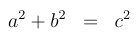
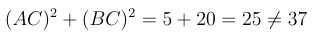

# Pythagoras

$$ a^{2}+b^{2}\;\;=\;\;c^{2} $$

$ (\langle i_{1}^{*}(\cdot,\cdot)^{3}\;\;\mid\;(\exists\tilde{\xi}\zeta^{\gamma})^{\gamma}\;-\;\ ;\;\;\gamma_{1}^{\prime})\,-\,\mathrm{?;\;\;7\;\;37} $

So we do not have a right-angled triangle.
